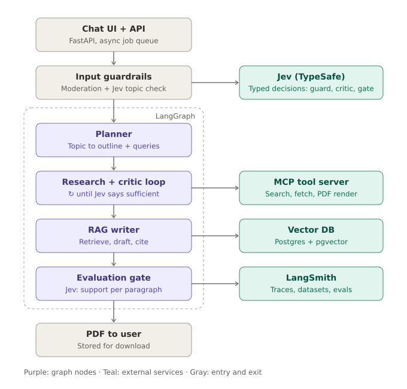
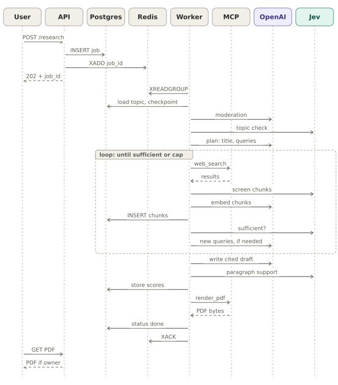
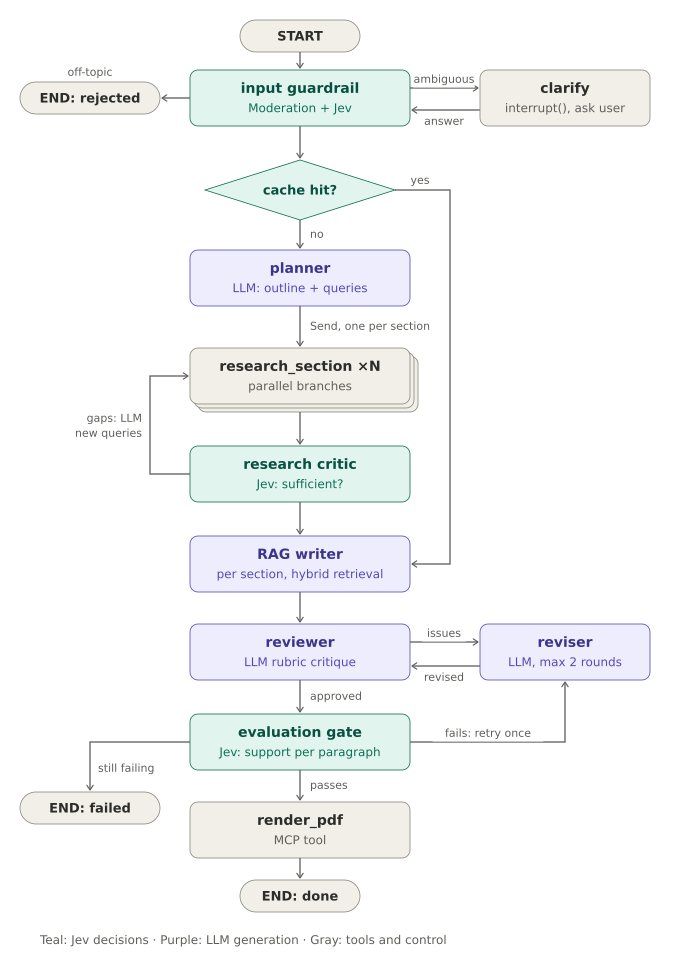
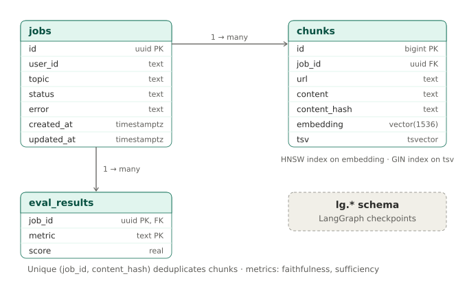

# 1. Architecture

> **Diagrams in this guide** (SVG files in `docs/images/`, linked relative to this file as `images/<name>.svg`; keep the `images/` folder next to the `.md` files):
> - `docs/images/architecture-overview.svg`: Architecture overview
> - `docs/images/request-sequence.svg`: Request lifecycle sequence
> - `docs/images/agent-graph-reference.svg`: Reference agent graph: Jev decisions and LLM generation
> - `docs/images/agent-graph-full.svg`: Full-design agent graph
> - `docs/images/data-model.svg`: Data model
> - `docs/images/local-topology.svg`: Local Docker network topology
> - `docs/images/aws-trust-zones.svg`: AWS deployment with trust zones

> All diagrams are generated by `scripts/generate_diagrams.py`; see `docs/images/README.md` for the full index.

## 1.1 Goal

A user types a technical subject into a chat ("How does Raft consensus work?"). The system checks that it is a genuine technical topic, researches it on the web over several rounds until a critic is satisfied, stores what it found in a vector database, writes a cited explainer from that material, checks the result for quality, and returns a PDF. Every step is traced in LangSmith.

The project is designed as a learning vehicle: nearly every component maps to a real production concern, whether that's agent orchestration, tool protocols, retrieval, evaluation, asynchronous architecture, or security.

## 1.2 The big picture



*Diagram file: `docs/images/architecture-overview.svg` (linked here as `images/architecture-overview.svg`)*

Reading top to bottom: the chat UI and API accept the topic and queue a job. Input guardrails filter out unsafe and non-technical requests, using Jev for the typed decisions. Inside the LangGraph orchestration, the planner turns the topic into an outline and search queries, the research-and-critic loop gathers material until it is sufficient, the RAG writer drafts from retrieved material with citations, and the evaluation gate decides whether the report is good enough to deliver. On the right are the external services the graph relies on: Jev for fast typed decisions (guardrail, critic, and evaluation gate), the MCP tool server for capabilities, the vector database for retrieval, and LangSmith for tracing and evaluation.

## 1.3 Two kinds of model: System 2 and System 1

The graph uses two kinds of model. An LLM (OpenAI) handles **System 2** work: open-ended reasoning and text generation, meaning planning queries, writing, and revising. **Jev**, TypeSafe's "System One" model, handles **System 1** work: fast, typed decisions with calibrated probabilities, meaning the guardrail, chunk screening, the research-sufficiency check, and the faithfulness gate. Jev does not generate text, so it complements the LLM rather than replacing it. When no TypeSafe key is configured, the same decisions fall back to LLM-as-judge. The full rationale, the node-by-node mapping, and the thresholds are in `08-jev-decision-model.md`.

## 1.4 A clarification about MCP

MCP (Model Context Protocol) is a protocol for exposing tools and data to an LLM application. It is **not** an orchestrator, and this affects the design.

LangGraph owns the control flow: state, loops, branching, retries, and checkpointing. The MCP server owns capabilities, exposing tools that the graph calls: `web_search`, `fetch_page`, and `render_pdf` (the full design adds an `ingest` tool). The worker connects to the server through `langchain-mcp-adapters`, which turns MCP tools into ordinary LangChain tools.

That split is the better lesson, because it's how production systems separate reasoning from capabilities. You can replace the orchestrator, or reuse the tool server from another client (Claude Desktop, the MCP Inspector, another agent), without changing the other side.

## 1.5 How each piece works

### Input guardrails

The guardrail has two layers. First, the OpenAI moderation endpoint catches unsafe input cheaply. Second, Jev answers two `Noul` questions about the input in one request: the probability that it's a technical topic, and the probability that it's an attempt to manipulate the system. Input below the technical threshold, or above the injection threshold, is rejected. (The LLM fallback uses a structured-output classifier instead.) Because Jev returns no text, the planner now produces the report's normalized title. In the full design, a gray zone asks a clarifying question instead ("Rust" could be the programming language or corrosion).

Build a labeled set of about 100 on-topic and off-topic prompts early. You'll use it to measure the guardrail's precision and recall, and it will be your first real evaluation (see `05-evaluation.md`).

### Research with critic loops

The planner turns the topic into an outline and search queries. The researcher calls MCP tools, has Jev screen every chunk for injected instructions and relevance, and ingests what survives. A critic node asks Jev for the probability that the sources are sufficient. If they aren't, the LLM writes targeted new queries and a conditional edge routes the flow back to research; otherwise it moves on to the writer. Splitting the critic this way means the LLM is called only when there's text to generate. Always cap the number of iterations: an unbounded critic loop is the classic way these agents burn money.

```python
def route_after_critic(state: State) -> str:
    if not state["gaps"] or state["iterations"] >= 3:
        return "writer"
    return "researcher"

graph.add_conditional_edges("critic", route_after_critic)
```

The full design has two critic loops. The first checks **research sufficiency**: is there enough material? The second, after writing, checks **output quality**: a reviewer critiques the draft for accuracy and clarity, and a reviser fixes it.

### The RAG layer

Fetched pages are split into chunks (about 800 tokens, or 3000 characters in the reference code, with overlap) and embedded with `text-embedding-3-small`. Each chunk is stored with metadata: source URL, topic or job, and fetch time. In the full design, the writer retrieves separately for each outline section rather than once for the whole document, and every claim carries a citation back to a chunk.

pgvector was chosen so that one Postgres instance holds job state, vectors, evaluation scores, and the LangGraph checkpointer. That's simpler to run, and it teaches hybrid search (keyword plus vector) in plain SQL. A useful system-design extension is a semantic cache: if a new topic is close enough to one already researched, the system reuses the existing chunks instead of searching the web again.

### Evaluation before presenting

Evaluation happens at two levels. The **online gate** runs on every request and checks faithfulness (whether the claims are supported by the retrieved context), answer relevancy, citation coverage, and outline completeness. The reference code implements faithfulness with Jev, asking one `Noul` per report paragraph ("every factual claim in paragraph N is supported by the sources") in a single parallel request, so the gate knows which paragraphs failed, not just an overall score. The full design adds RAGAS metrics and the rest. The **offline regression suite** is a LangSmith dataset of benchmark topics, run as an experiment whenever a prompt or model changes, so you can see whether quality went up or down. Tracing tells you why a run was slow or wrong; experiments tell you whether a change helped.

### Hosting

A full run takes minutes, so it can't happen inside a single HTTP request. The API enqueues a job and returns a job ID immediately. A worker runs the graph, and the client polls for status (or, in the full design, listens over server-sent events). This queue-plus-worker pattern is the same locally (`02-setup-local.md`) and in the cloud (`06-cloud-deployment.md`).

## 1.6 Service layout

The system is split into four deployable units plus shared infrastructure, so each gets its own permissions and scaling.

```
research-agent/
├── api/          # FastAPI: auth, job submission, status, PDF download
├── worker/       # LangGraph runtime: consumes jobs from the queue
├── mcp_server/   # FastMCP: web_search, fetch_page, render_pdf
├── infra/        # Postgres schema and roles, Caddy config
├── evals/        # LangSmith datasets and evaluation scripts
└── scripts/      # Secret generation, smoke test, isolation checks
```

The API never runs LLM calls itself. It accepts work, authorizes users, and reports status. The worker holds the graph. The MCP server is the only component that touches the open internet for content. That last separation matters a great deal for security (see `04-security.md`).

| Component | Responsibility | Talks to |
|---|---|---|
| Caddy | TLS termination, security headers, request size limit | API only |
| API (FastAPI) | Authentication, validation, rate limiting, job submission, status, PDF download | Postgres, Redis |
| Redis Stream | Durable job queue with acknowledgements | API writes, workers read |
| Worker (LangGraph) | Runs the agent graph; the only component that calls the LLM | Postgres, Redis, MCP server, OpenAI, LangSmith |
| MCP server (FastMCP) | Tools for search, fetch, and PDF rendering; the only component that reads the open web | Web only |
| Postgres + pgvector | Jobs, embedded chunks, evaluation scores, LangGraph checkpoints | API, worker |
| LangSmith | Tracing, datasets, experiments | Worker, eval scripts |

## 1.7 Request lifecycle



*Diagram file: `docs/images/request-sequence.svg` (linked here as `images/request-sequence.svg`)*

**Step 1: Submission.** The chat UI sends `POST /research` with the user's token and the raw topic. The API validates the payload (3–300 printable characters), applies the per-user rate limit, and inserts a `jobs` row with status `queued`. It adds `{job_id}` to the queue and returns `202 Accepted` with the job ID. Only the ID goes on the queue, never the topic text. The worker reads the topic from the database, which keeps a single source of truth. (The full design streams progress over server-sent events: "planning", "researching 3/6 sections", "evaluating".)

**Step 2: Graph start.** A worker receives the message and loads the compiled LangGraph with a Postgres checkpointer, using `thread_id = job_id`. Every node transition is checkpointed. If a container dies mid-run, another worker resumes from the last completed node instead of starting over and paying for the same LLM calls twice. LangSmith tracing is enabled through environment variables, and each run is tagged with its job ID.

**Step 3: Input guardrail.** OpenAI moderation screens for unsafe content, then Jev returns probabilities that the input is technical and that it's a manipulation attempt. A conditional edge routes on the decision. In the full design, a `clarify` branch calls LangGraph's `interrupt()` to pause the run with a question; the API shows it to the user, and their answer resumes the same thread. That's human-in-the-loop, and it's worth learning.

**Step 4: Planner (with semantic cache in the full design).** Before planning, the full design embeds the normalized topic and checks a `topics` table for an entry with cosine similarity above about 0.92 that was researched in the last 30 days. On a hit it skips to the writer and reuses that knowledge base. On a miss, the planner produces structured output: 5–8 outline sections, each with 2–3 search queries and a short statement of what the section must answer. Those "must answer" statements matter later, because both the critic and the evaluator check against them. The reference code produces a flat list of 3–5 queries.

**Step 5: Researcher.** In the full design, LangGraph's `Send` API spawns one research branch per section, so all sections search concurrently. Each branch calls `web_search` (Tavily, with extracted page content), optionally `fetch_page` for results that need full text, and then ingests the text. Ingesting means cleaning and chunking, then having Jev screen each chunk for injected instructions and relevance, then embedding, deduplicating by SHA-256 content hash, and upserting with provenance metadata.

**Step 6: Research critic loop.** For each section (or, in the reference code, for the whole topic), the critic retrieves the top-k chunks and asks Jev for the probability that they are enough to answer the "must answer" statement. Only when they aren't does the LLM write new queries. Insufficient sections go back to the researcher with the new, targeted queries, up to a fixed number of rounds. After that the flow continues and the gaps are recorded, so the writer can say "sources on X were limited" rather than making things up.

**Step 7: RAG writer.** In the full design, retrieval runs per section and is hybrid: a pgvector similarity search plus a Postgres full-text search, merged with reciprocal rank fusion. Keyword search catches exact API names and version numbers that embeddings tend to blur. Optionally, a reranker narrows about 20 candidates to the best 6. The prompt gives each chunk a numbered ID, and the writer must cite with those numbers, which are resolved to a references list with URLs. Sections can be written in parallel, followed by a pass that writes the introduction and summary.

**Step 8: Quality critic and reviser loop (full design).** A reviewer scores the draft against a rubric: technical accuracy against the cited chunks, clarity, logical order, consistent terminology, and appropriate depth. Ideally it uses a different model or prompt persona from the writer, so it doesn't just approve its own style. A reviser applies the fixes, with a maximum of two iterations. This is the second critic loop.

**Step 9: Evaluation gate.** The evaluator asks Jev one question per paragraph, computes scores, and decides whether the document ships. See section 1.9 for the full set of checks.

**Step 10: PDF rendering.** The `render_pdf` MCP tool converts Markdown to HTML, sanitizes it against a tag allowlist, and renders it with WeasyPrint using a URL fetcher that refuses every external resource. The worker stores the PDF (a local volume, or S3 with KMS encryption in the cloud).

**Step 11: Delivery.** The job is marked `done` (or `done_low_confidence`). When the client requests the file, the API checks ownership before serving it (locally, it streams the file; in the cloud, it returns a pre-signed S3 URL that expires in about 10 minutes).

## 1.8 The agent graph

### Reference implementation


*Diagram file: `docs/images/agent-graph-reference.svg` (linked here as `images/agent-graph-reference.svg`)*

Teal nodes decide with Jev; purple nodes generate text with the LLM.

| Node | Reads from state | Writes to state | LLM use |
|---|---|---|---|
| `guardrail` | `raw_input` | `decision`, `topic`, `guard_scores`, or `final_status` | Moderation + Jev (`technical`, `injection` Nouls) |
| `planner` | `topic` | `topic` (title), `queries` | LLM, structured output |
| `researcher` | `queries` | `iterations`, `chunks_dropped` (chunks go to Postgres) | MCP `web_search`; Jev chunk screening; embeddings |
| `critic` | `topic` | `sufficient`, `sufficiency`, `queries` | Jev sufficiency Noul; LLM only for new queries |
| `writer` | `topic` | `draft` | LLM, Markdown over retrieved chunks |
| `evaluator` | `draft` | `faithfulness`, `unsupported` (scores also in Postgres) | Jev, one Noul per paragraph |
| `render` | `draft`, `faithfulness` | `final_status` | None; MCP `render_pdf` |
| `quality_fail` | none | `final_status`, `error` | None |

### Full design



*Diagram file: `docs/images/agent-graph-full.svg` (linked here as `images/agent-graph-full.svg`)*

### State

```python
class State(TypedDict, total=False):
    job_id: str
    raw_input: str
    topic: str
    decision: str          # proceed | reject
    guard_scores: dict     # Jev probabilities: technical, injection
    queries: list[str]
    iterations: int
    chunks_dropped: int    # removed by Jev screening
    sufficient: bool
    sufficiency: float     # Jev probability the sources are enough
    draft: str
    faithfulness: float    # share of paragraphs Jev judged supported
    unsupported: list[str] # paragraphs that failed, for a reviser
    final_status: str      # done | done_low_confidence | rejected | failed
    error: str
```

Large data (web text, embeddings) lives in Postgres rather than in graph state. State is checkpointed after every node, so keeping it small keeps checkpoints cheap and avoids copying untrusted web content around.

## 1.9 The evaluation gate

| Check | Method | Threshold |
|---|---|---|
| Faithfulness | Jev `Noul` per paragraph (LLM judge as fallback), or RAGAS faithfulness | ≥ 0.85 in the full design (0.80 pass / 0.60 minimum in the reference) |
| Answer relevancy | RAGAS response relevancy against the topic | ≥ 0.80 |
| Citation coverage | Share of paragraphs with at least one resolved citation | ≥ 0.90 |
| Outline completeness | Every "must answer" statement addressed | 100% |
| Source copying | Longest verbatim word run shared with any chunk | < 25 words |
| Output safety | Moderation plus a PII scan (for example, Presidio) | Zero hits |

The copying check keeps the report from reproducing web articles verbatim, which is both a quality problem and a copyright one. The routing in the full design:

```python
def route_after_eval(state: State) -> str:
    if state["eval_passed"]:
        return "render_pdf"
    if state["revision_attempts"] < 1:
        return "reviser"   # feed failing metrics back as instructions
    return "render_pdf_with_warning" if state["eval_scores"]["faithfulness"] >= 0.7 else "fail"
```

Every score is also written to LangSmith as feedback on the run, so production quality shows up on dashboards.

## 1.10 MCP server and data model

The MCP server uses FastMCP over the streamable HTTP transport. Tools are plain typed functions; the type hints and docstrings become the schema and description the LLM sees.

```python
mcp = FastMCP("research-tools")

@mcp.tool()
async def fetch_page(url: str) -> str:
    """Fetch a public web page and return its main text."""
    assert_public_url(url)                       # SSRF guard, see 04-security.md
    html = await safe_get(url, timeout=10, max_bytes=2_000_000)
    return extract_main_text(html)[:20_000]
```

The worker loads these tools with `MultiServerMCPClient` and gives each node only the tools it needs. The writer and the critics get no tools at all.



*Diagram file: `docs/images/data-model.svg` (linked here as `images/data-model.svg`)*

`chunks.embedding` has an HNSW index for cosine similarity, and `chunks.tsv` (a generated `tsvector`) has a GIN index for keyword search, ready for hybrid retrieval. LangGraph's checkpointer creates its own tables in the `lg` schema. The full design adds a `topics` table (normalized topic, embedding, last researched time) for the semantic cache and a `documents` table with one row per source URL.

## 1.11 Deployment views

**Locally**, each component is a Docker Compose service, and Docker networks play the role of subnets and security groups:


*Diagram file: `docs/images/local-topology.svg` (linked here as `images/local-topology.svg`)*

Networks marked internal have no route to the internet. The API can't reach the internet or the MCP server, and the MCP server can't reach any data store.

**In the cloud**, the same boundaries become subnets, security groups, and IAM roles:


*Diagram file: `docs/images/aws-trust-zones.svg` (linked here as `images/aws-trust-zones.svg`)*

Each service runs as its own ECS Fargate service with its own IAM task role and security group. Security groups allow only the arrows shown: load balancer to API, API to the queue, worker to MCP server, and application services to the data tier. The MCP server has no route to Postgres, S3, or Secrets Manager. Workers autoscale on queue depth and the API on CPU. S3, SQS, and Secrets Manager are reached through VPC endpoints, so that traffic never crosses the internet. All outbound traffic leaves through NAT with logging. See `06-cloud-deployment.md` for the build order.

## 1.12 Key design decisions

**Queue plus worker instead of a synchronous request.** Holding an HTTP request open for minutes breaks behind proxies and ties API capacity to LLM latency. The queue decouples them, lets workers scale independently, and provides backpressure.

**Checkpointing.** The Postgres checkpointer makes runs resumable after a crash, saves money because completed LLM calls aren't repeated, and is the foundation for human-in-the-loop pauses with `interrupt()`.

**One database.** pgvector keeps jobs, vectors, evaluation scores, and checkpoints in one Postgres: one thing to back up and secure, and hybrid search in plain SQL. A dedicated vector database (Qdrant, Weaviate) becomes worthwhile at much larger scale or when you need features Postgres lacks.

**Chunks scoped to a job.** The reference stores chunks per job, which keeps retrieval clean and deletion simple. The full design adds a shared, topic-level knowledge base with a semantic cache.

**Least power for the component reading untrusted text.** Web content is the main prompt-injection risk. The researcher can only search and fetch. The writer, critic, and evaluator have no tools. The MCP server that touches the web has no access to data. So even if a web page hijacks a model's instructions, the worst outcome is a bad paragraph, which the evaluation gate is designed to catch.

**Typed decisions for System 1 work.** Asking an LLM to classify and then parsing its answer is slow and costly, and its self-reported confidence isn't calibrated. Jev returns calibrated probabilities in one parallel pass, which makes thresholds meaningful and makes per-chunk and per-paragraph checks affordable. Keeping both engines behind one interface keeps the project runnable without Jev and makes the two measurable against each other.

**Python for the agent side.** LangGraph, LangSmith, RAGAS, and the MCP Python SDK are all Python-first, and the Java ports lag behind. Tavily is the simplest search API to start with because it returns clean extracted content, and WeasyPrint handles Markdown-to-PDF well.

## 1.13 Suggested build order

| Phase | Build | You learn |
|---|---|---|
| 1 | Linear script: topic → search → summarize → PDF | LangChain basics, prompting, PDF rendering |
| 2 | Convert to a LangGraph with a critic loop and Postgres checkpointer | State machines, conditional edges, resumability |
| 3 | Move tools into an MCP server | MCP protocol, tool design, service boundaries |
| 4 | Add pgvector RAG with retrieval and citations | Chunking, embeddings, retrieval quality |
| 5 | Guardrails, online eval gate, LangSmith datasets | Evals, LLM-as-judge, regression testing |
| 6 | Containerize, add queue and workers, deploy | Async architecture, security, observability, cost control |

The detailed version, with checkpoints and stretch goals for each phase, is `03-implementation-guide.md`.

## 1.14 Reference implementation versus full design

| Area | Reference code | Full design |
|---|---|---|
| Planning | Flat list of queries | Outline with per-section "must answer" statements |
| Research | Sequential, whole topic | Parallel per-section fan-out with `Send` |
| Retrieval | Vector similarity | Hybrid vector + keyword with reciprocal rank fusion, optional reranker |
| Critic loops | Research sufficiency | Plus reviewer → reviser loop on the draft |
| Evaluation | Jev per-paragraph faithfulness | RAGAS faithfulness and relevancy, citation coverage, completeness, copy detection |
| Guardrail | Jev accept or reject, with an injection signal | Plus clarification via `interrupt()` |
| Caching | None | Semantic topic cache |
| Progress | Polling | Server-sent events |
