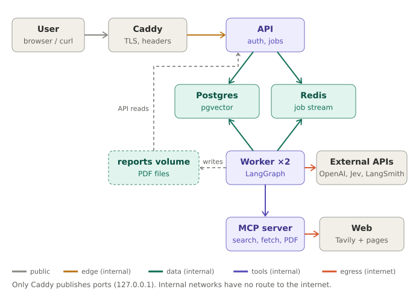

# 2. Local setup (Ubuntu)

> **Diagrams in this guide** (SVG files in `docs/images/`, linked relative to this file as `images/<name>.svg`; keep the `images/` folder next to the `.md` files):
> - `docs/images/local-topology.svg`: Local Docker network topology

This guide runs the reference implementation on one Linux machine with Docker Compose.

## How the cloud design maps to one machine

| Cloud component | Local replacement |
|---|---|
| Load balancer + WAF | Caddy with automatic local TLS |
| Container service (ECS) | Docker Compose services |
| VPC subnets + security groups | Separate Docker networks, most `internal: true` |
| NAT egress | Only the `egress` network reaches the internet |
| Managed Postgres + pgvector | `pgvector/pgvector:pg16` container |
| SQS | Redis Streams with a consumer group |
| S3 + pre-signed URLs | Shared `reports` volume served by the API after an ownership check |
| Secrets Manager | Docker Compose secrets mounted at `/run/secrets` |
| Cognito | Per-user bearer tokens (upgrade path to Keycloak in step 12) |
| LangSmith | LangSmith cloud (free tier) |

## Local topology



*Diagram file: `docs/images/local-topology.svg` (linked here as `images/local-topology.svg`)*

Only Caddy publishes ports, and only on `127.0.0.1`. The `edge`, `data`, and `tools` networks are internal, meaning containers on them have no route to the internet. The API therefore can't reach the internet at all, and the MCP server, which reads untrusted web pages, can't reach Postgres, Redis, or the API. Step 8 verifies all of this.

The reference code is a minimal end-to-end graph (guardrail → planner → researcher ⇄ critic → writer → evaluator → render). Decisions use Jev when a TypeSafe key is configured and fall back to the LLM otherwise (see `08-jev-decision-model.md`). It proves every moving part works before you add per-section fan-out, hybrid search, and the reviewer loop described in `01-architecture.md`.

## Step 1: Install prerequisites

Install Docker Engine and the Compose plugin from Docker's apt repository, plus some utilities:

```bash
sudo apt-get update
sudo apt-get install -y ca-certificates curl jq openssl make unzip python3-venv
sudo install -m 0755 -d /etc/apt/keyrings
sudo curl -fsSL https://download.docker.com/linux/ubuntu/gpg -o /etc/apt/keyrings/docker.asc
echo "deb [arch=$(dpkg --print-architecture) signed-by=/etc/apt/keyrings/docker.asc] \
https://download.docker.com/linux/ubuntu $(. /etc/os-release && echo $VERSION_CODENAME) stable" \
 | sudo tee /etc/apt/sources.list.d/docker.list
sudo apt-get update
sudo apt-get install -y docker-ce docker-ce-cli containerd.io docker-buildx-plugin docker-compose-plugin
docker compose version
```

To run Docker without `sudo`, either add yourself to the `docker` group (`sudo usermod -aG docker $USER`, then log out and in), keeping in mind that this group is effectively root, or use rootless Docker (`dockerd-rootless-setuptool.sh install`). With rootless Docker, change Caddy's published ports in `docker-compose.yml` to 8443 and 8080.

About 4 GB of free RAM and 10 GB of disk are enough, since the LLM runs remotely.

## Step 2: Get API keys

Get an OpenAI API key (set a monthly spend limit on the project), a Tavily API key (the free tier is enough), and a LangSmith API key (optional, but tracing is a large part of the learning value). For Jev, request early access from TypeSafe AI and create a key in the TypeSafe console. The key is optional: without it, the worker uses the LLM for decisions.

## Step 3: Unpack and commit

```bash
cd ~ && unzip research-agent.zip && cd research-agent
git init && git add . && git commit -m "Initial import"
```

`.gitignore` already excludes `.env`, `secrets/`, backups, and generated PDFs.

## Step 4: Generate secrets

```bash
make secrets
```

This writes random values for the Postgres superuser, the two application roles, Redis, and the MCP service token, creates `secrets/api_tokens` with a `dev` user, and prompts (hidden input) for the API keys (OpenAI, Tavily, LangSmith, TypeSafe). The directory is mode 700 so other users can't read into it; the files are mode 644 so the containers' non-root user (UID 10001) can read its bind mounts. Add more users as `user_id:token` lines, generating tokens with `openssl rand -hex 24`.

## Step 5: Configure

```bash
cp .env.example .env
nano .env
```

Set `OPENAI_CHAT_MODEL` to a current model on your account; it is `CHANGE_ME` on purpose so the worker fails fast. Set `ENABLE_DOCS=1` for the Swagger UI at `/docs` during development.

## Step 6: Build and start

```bash
make up
make ps
make logs
```

On first start, Postgres runs `infra/postgres/01-schema.sql` (extension, tables, indexes) and `02-roles.sh` (least-privilege roles). Wait until `postgres`, `redis`, `api`, and `mcp` are healthy and both worker replicas log `worker ... ready (decision engine: jev)` (or `llm` without a TypeSafe key).

## Step 7: Trust the local certificate (optional)

```bash
make trust-ca    # saves infra/caddy-root.crt; scripts use it automatically
sudo cp infra/caddy-root.crt /usr/local/share/ca-certificates/caddy-local.crt
sudo update-ca-certificates
```

Firefox and Chrome keep their own certificate stores on Linux; import the file there to use a browser.

## Step 8: Verify isolation

```bash
make isolation
```

Every line should read `ok`. The script checks that the API can't reach the internet or the MCP server, that the MCP server can't reach Postgres, Redis, or the API, that the expected paths work, and that the SSRF guard rejects the metadata address, loopback, internal hostnames, and `file://` URLs.

## Step 9: First report

```bash
make smoke TOPIC="How does Raft consensus work"
```

Expect 1–3 minutes. Also try a non-technical topic (it should end `rejected`) and an unauthenticated request (`curl -k https://localhost/jobs/x` should return 401).

## Step 10: Explore traces

In LangSmith, open the `research-agent-local` project. Each job is a `research-job` run with its job ID in the metadata. Look at how many critic rounds ran, token usage per node, and the MCP tool calls. Stored scores:

```bash
docker compose exec postgres psql -U agent -c \
  "SELECT j.topic, e.metric, e.score FROM eval_results e JOIN jobs j ON j.id = e.job_id;"
```

## Step 11: Test resilience

Submit a job and, while it is `running`, run `docker compose restart worker`. After the reclaim window (15 minutes; lower `min_idle_time` in `worker/main.py` to test faster), another worker resumes the job from its last checkpoint and logs `resuming job ... at (...)`. Submit several jobs to watch the replicas share the load, and scale with `docker compose up -d --scale worker=4`.

## Step 12: Operate and harden

**Network exposure.** Ports are bound to `127.0.0.1`. Docker's published ports bypass `ufw`, so if you bind to `0.0.0.0` for LAN access, restrict traffic with rules in the `DOCKER-USER` iptables chain and change the Caddyfile site from `localhost` to the machine's hostname.

**Backups.** `make backup` writes a compressed `pg_dump` to `./backups`. PDFs live in the `reports` volume. `make reset` deletes all volumes.

**Updates.** Rebuild with `docker compose build --pull`. For reproducible builds, generate lockfiles (`uv pip compile requirements.txt -o requirements.lock`) and install from them. Scan with `trivy image research-agent-worker` and `pip-audit`.

**Authentication.** To practice OIDC, add a Keycloak container on the `edge` network and replace `current_user()` in `api/main.py` with JWT validation against Keycloak's JWKS endpoint. Ownership checks stay unchanged.

**Disk encryption.** The stack does not encrypt data at rest. Use full-disk encryption (LUKS) on the machine if that matters to you.

## Troubleshooting

| Symptom | Likely cause and fix |
|---|---|
| Schema or role changes don't appear | Init scripts run only on an empty volume. `make reset` (deletes data), then `make up`. |
| Worker exits immediately | `OPENAI_CHAT_MODEL` still `CHANGE_ME`, empty OpenAI key, or MCP not healthy. Check `docker compose logs worker`. |
| `Permission denied` on `/run/secrets/...` | Rerun `make secrets` to reset file modes. |
| MCP rejects requests with a host or origin error | Your `mcp` version enforces DNS-rebinding protection; allow host `mcp:8000` via its transport security settings. |
| Missing characters in PDFs | Add fonts (for example `fonts-noto-core`) to the `apt-get` line in `mcp_server/Dockerfile`. |
| Worker logs `decision engine: llm` although you added a TypeSafe key | The key file was empty when the worker started. Put the key in `secrets/typesafe_api_key`, then `docker compose up -d --force-recreate worker`. |
| TypeSafe request errors about input size | The critic or evaluator state is too large; lower `k` in `retrieve()` or split the paragraph checks into several requests. |
| `429 hourly job limit reached` | Raise `JOBS_PER_HOUR` in `.env` and `docker compose up -d api`. |
| Structured output errors from OpenAI | Some models reject certain JSON schema features; try another model, or pass `method="function_calling"` to `with_structured_output`. |
