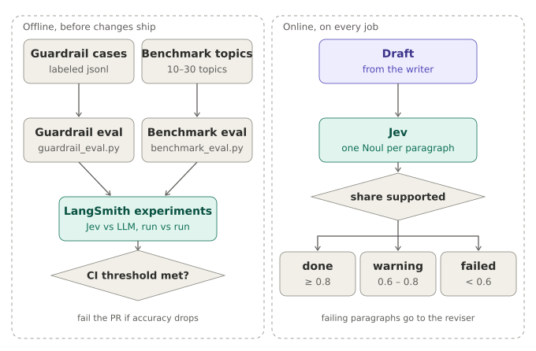

# 5. Evaluation

> **Diagrams in this guide** (SVG files in `docs/images/`, linked relative to this file as `images/<name>.svg`; keep the `images/` folder next to the `.md` files):
> - `docs/images/eval-flow.svg`: Offline evaluation suite and online quality gate

Evaluation happens at three levels, each answering a different question.

| Level | When it runs | Question it answers |
|---|---|---|
| Guardrail eval | Offline, after changing the guardrail | Does the classifier accept technical topics and reject everything else? |
| Online quality gate | On every job, inside the graph | Is this specific report good enough to deliver? |
| Offline benchmark | Offline, after any prompt, model, or graph change | Did this change make the system better or worse overall? |



*Diagram file: `docs/images/eval-flow.svg` (linked here as `images/eval-flow.svg`)*

The online gate protects each individual user from a bad report. The offline suite protects the system from a bad change: a prompt edit, a model swap, or a new graph node. Tracing tells you why a run was slow or wrong; experiments tell you whether a change helped.

## Online quality gate

The `evaluator` node asks Jev one `Noul` question per report paragraph, "every factual claim in paragraph N is supported by the sources", all in a single parallel request. Faithfulness is the share of paragraphs at or above 0.5, and the failing paragraphs are kept in state for a reviser. (Without a TypeSafe key, an LLM judge lists the supported paragraphs instead.) The critic's sufficiency probability is also stored, as `sufficiency`. The score is stored in `eval_results` and exposed as `faithfulness` in `GET /jobs/{id}`.

| Score | Outcome |
|---|---|
| ≥ 0.80 | Delivered as `done` |
| 0.60 – 0.80 | Delivered as `done_low_confidence`, with a warning banner in the PDF |
| < 0.60 | `failed` with "report failed the quality gate" |

These thresholds are starting points. Jev's probabilities are designed to be calibrated, but verify that on your own data. Calibrate them: read ten reports, mark which ones you'd accept, and set the thresholds where the judge's scores separate your good and bad sets.

**Metrics for the full design.** Faithfulness (claims supported by sources). Response relevancy (the report answers the topic). Citation coverage (share of paragraphs with a valid `[n]` that resolves to a reference). Outline completeness (every planned "must answer" statement is addressed). Copy detection (longest verbatim word run shared with any chunk stays under 25 words). Output safety (moderation and PII scan find nothing).

**LLM-as-judge caveats.** Judges prefer fluent, confident text and can be lenient toward output from their own model family. Use a strict rubric, ask for evidence (the list of unsupported claims), keep temperature low where the model allows it, and periodically check judge scores against your own review.

**RAGAS.** RAGAS provides standard implementations of faithfulness and response relevancy. Its API has changed across major versions, so check the documentation for the version you install. The shape is: build an evaluation sample from the topic, the report, and the retrieved chunk texts, then score it with the metric objects using your OpenAI model as the evaluator LLM.

## LangSmith setup

Set `LANGSMITH_TRACING=true`, `LANGSMITH_API_KEY`, and `LANGSMITH_PROJECT`. The worker names each run `research-job` and attaches the job ID as metadata, so you can go from a job in the database to its trace. In the LangSmith UI you can add online evaluator rules that sample production runs and score them with an LLM judge, and build dashboards for latency, token usage, and error rate.

## Offline evals in this repository

```bash
make eval-setup                       # creates .venv with evals/requirements.txt
make eval-guardrail                   # classifier accuracy and false-accept rate
make eval-benchmark                   # end-to-end benchmark through the running API
```

Both scripts create their LangSmith dataset on the first run from the files in `evals/datasets/`, then run an experiment. Each run prints a link to the experiment in LangSmith, where you can compare it with earlier runs side by side.

**Guardrail eval (`evals/guardrail_eval.py`).** Imports the worker's own `decisions.py`, so it tests exactly the code that runs in production, with `--engine jev` or `--engine llm` (`make eval-guardrail ENGINE=llm`). It runs over `guardrail_cases.jsonl`: technical topics, non-technical topics, ambiguous ones, and injection attempts. Per-example it scores correctness; across the dataset it reports the false-accept rate (non-technical or malicious input that got through) and false-reject rate. False accepts cost money and risk misuse; false rejects annoy users. Decide which matters more and tune the confidence threshold accordingly. Run it once per engine and compare the two experiments in LangSmith: accuracy, error rates, latency per example, and token cost. That comparison is how you decide whether Jev earns its place.

**Benchmark eval (`evals/benchmark_eval.py`).** Submits each topic in `benchmark_topics.json` through the real API, waits for completion, and records whether it completed, its faithfulness score, and its duration. Raise `JOBS_PER_HOUR` in `.env` before running it, since each topic counts against the limit. A full run costs real API money, so keep the set small (10–30 topics) and run it deliberately.

## Building good datasets

For the guardrail, aim for about 100 cases eventually, balanced between accept and reject, including borderline cases ("Python" the language versus the snake, "cooking chemistry", "history of the transistor"), prompt injections, and multilingual inputs. For the benchmark, mix easy, well-documented topics, very recent technologies with sparse sources, and topics prone to confusion. Every time a real run goes wrong, add that topic to a dataset. That is how the evaluation set comes to reflect real failures.

## Running evals in CI

A GitHub Actions job can run the guardrail eval whenever prompts or the graph change. The benchmark needs the whole stack running, so run it manually or on a schedule.

```yaml
name: guardrail-eval
on:
  pull_request:
    paths: ["worker/**", "evals/**"]
jobs:
  eval:
    runs-on: ubuntu-latest
    steps:
      - uses: actions/checkout@v4
      - uses: actions/setup-python@v5
        with: {python-version: "3.12"}
      - run: pip install -r evals/requirements.txt
      - run: python evals/guardrail_eval.py --engine jev --min-accuracy 0.9
        env:
          OPENAI_API_KEY: ${{ secrets.OPENAI_API_KEY }}
          LANGSMITH_API_KEY: ${{ secrets.LANGSMITH_API_KEY }}
          TYPESAFE_API_KEY: ${{ secrets.TYPESAFE_API_KEY }}
          OPENAI_CHAT_MODEL: ${{ vars.OPENAI_CHAT_MODEL }}
```

The `--min-accuracy` flag makes the script exit with a non-zero code when accuracy falls below the threshold, which fails the pull request.
